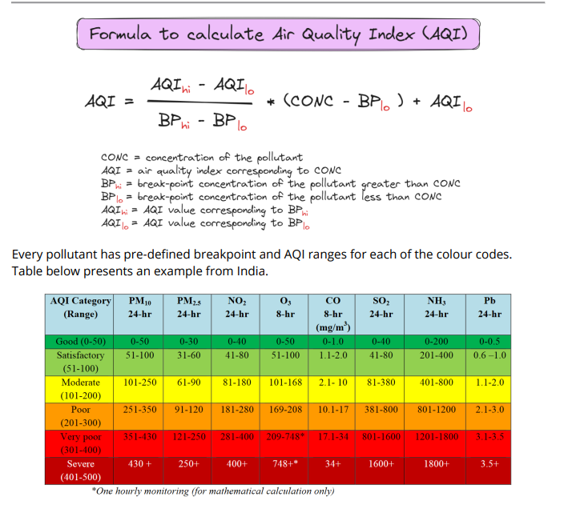

# AQI Simple Reflex Agent

## Overview

This project implements a **Simple Reflex AI Agent** in C that computes
the **Air Quality Index (AQI)** of a region using pollutant
concentrations obtained from a sensor file (`data.txt`).

The agent follows the standard AQI breakpoint methodology, where each
pollutant concentration is mapped to a sub-index using interpolation,
and the **final AQI equals the maximum sub-index**.

------------------------------------------------------------------------

# AI Agent Model

```
  Component     Implementation
  ------------- ----------------------------------
  Environment   Regional air quality
  Sensors       Pollutant data file (`data.txt`)
  Percepts      PM2.5, PM10, NO₂, SO₂, CO, O₃
  Rules         AQI breakpoint tables
  Decision      Maximum pollutant sub-index
  Action        Display AQI and category
```
------------------------------------------------------------------------

# Pollutants Considered

This implementation uses six core AQI pollutants:

-   PM2.5
-   PM10
-   NO₂
-   SO₂
-   CO
-   O₃

AQI is determined by the **highest sub-index among available
pollutants**.

------------------------------------------------------------------------

# AQI Methodology

Each pollutant concentration is converted to a sub-index using
breakpoint linear interpolation:

    I = (I_hi − I_lo) / (BP_hi − BP_lo) × (C − BP_lo) + I_lo

Where:

-   **C** = pollutant concentration
-   **BP_lo / BP_hi** = breakpoint concentration bounds
-   **I_lo / I_hi** = AQI bounds

Final AQI:

    AQI = max(sub-index of all pollutants)

------------------------------------------------------------------------

# AQI Calculation Formula



Source:
https://urbanemissions.info/wp-content/uploads/docs/SIM-46-2021.pdf

------------------------------------------------------------------------

# AQI Categories

```
  AQI Range   Category
  ----------- --------------
  0--50       Good
  51--100     Satisfactory
  101--200    Moderate
  201--300    Poor
  301--400    Very Poor
  401--500    Severe
```

------------------------------------------------------------------------

# Input File Format

Create a file named **`data.txt`** in the program directory.

Example:

    PM25=120
    PM10=180
    NO2=70
    SO2=20
    CO=1.2
    O3=40

Each line must follow:

    POLLUTANT=VALUE

------------------------------------------------------------------------

## Invalid Formats (will fail parsing)

    PM25 = 120   ❌ spaces around '='
    pm25=120     ❌ lowercase key
    PM2.5=120    ❌ dot in key
    PM25:120     ❌ wrong separator

The parser expects **exact uppercase keys without spaces**.

------------------------------------------------------------------------

# Program Architecture

    aqi_agent.c
    │
    ├── AQIRange struct
    ├── AQI breakpoint tables
    ├── calculate_subAQI()   → AQI interpolation
    ├── category()    → AQI classification
    ├── read_data()   → Sensor file reader
    └── main()        → Agent loop

------------------------------------------------------------------------

# Compilation & Execution

## Compile

``` bash
gcc aqi_agent.c -o aqi
```

## Run

``` bash
./aqi
```

------------------------------------------------------------------------

# References

UrbanEmissions AQI Methodology\
https://urbanemissions.info/wp-content/uploads/docs/SIM-46-2021.pdf

------------------------------------------------------------------------

# License

Educational and academic use.


