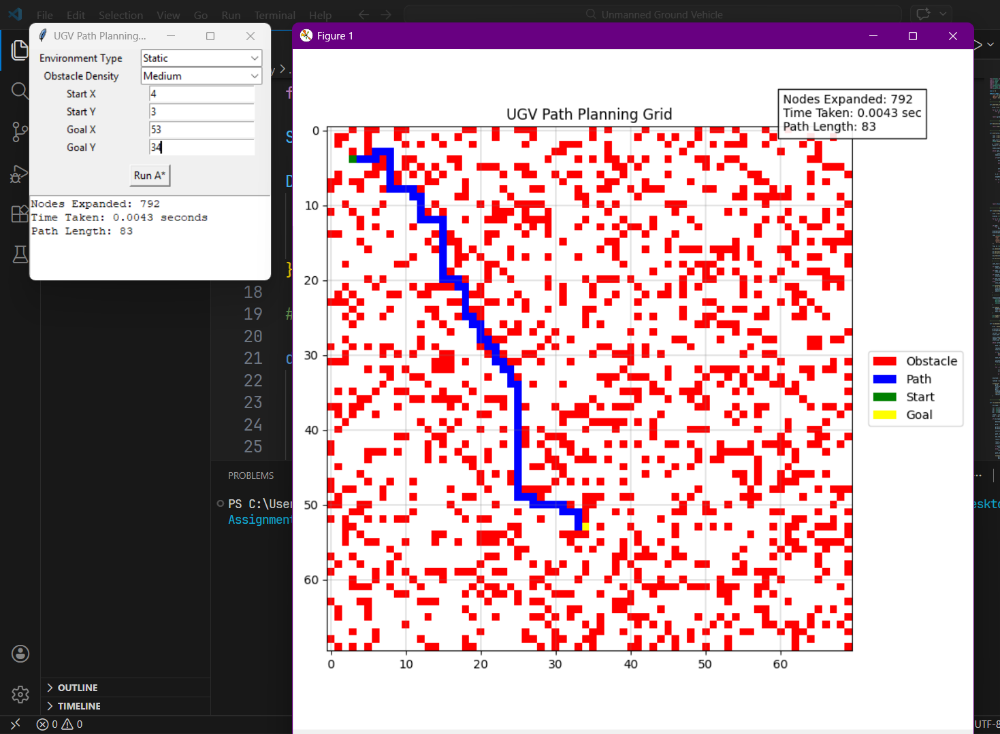

# UGV Path Planning Simulator


A Python-based simulator for **Unmanned Ground Vehicle (UGV) navigation** in a grid-based battlefield environment.  
The system computes the **optimal path between a start node and goal node** while avoiding obstacles using the **A\* search algorithm**.

The simulator supports:

- **Static environments** where obstacles are known beforehand
- **Dynamic environments** where obstacles can appear or disappear during navigation

The project includes a **GUI built with Tkinter** and **visualization using Matplotlib**.

---

# Overview

Autonomous ground vehicles must navigate complex environments while avoiding obstacles and minimizing travel cost.

This project models the battlefield as a **70 × 70 grid**, where:

- Each cell represents a position in the map
- Cells may contain **free space or obstacles**
- Obstacles are randomly generated based on configurable density levels
- The **A\* search algorithm** computes the shortest path between start and goal nodes

The simulator also measures algorithm performance using **Measures of Effectiveness (MOE)**.

---

# Features

- 70 × 70 grid-based battlefield simulation
- Random obstacle generation
- Three obstacle density levels
- Optimal path computation using **A\***
- Static obstacle environment
- Dynamic obstacle simulation with path replanning
- Interactive GUI for start and goal coordinates
- Visualization of grid and path
- Performance metrics for evaluation

---

# Environment Representation

The battlefield is modeled as a **2D grid**.

| Value | Meaning |
|------|------|
| 0 | Free space |
| 1 | Obstacle |

Movement is allowed in four directions:

- Up
- Down
- Left
- Right

Each movement has **cost = 1**.

---

# A* Pathfinding Algorithm

For each node `n`:

```
f(n) = g(n) + h(n)
```

Where:

- `g(n)` = cost from start to node `n`
- `h(n)` = estimated cost from node `n` to goal
- `f(n)` = total estimated cost

---

# Heuristic Function

The heuristic used is **Manhattan Distance**:

```
h(a,b) = |ax − bx| + |ay − by|
```

This heuristic guarantees optimal paths for grid navigation.

---

# Static Environment

1. A grid is generated with obstacles  
2. User selects obstacle density  
3. A* computes optimal path  
4. Path is visualized  

Obstacle density levels:

| Density | Probability |
|------|------|
| Low | 10% |
| Medium | 25% |
| High | 40% |

---

# Dynamic Environment

To simulate real-world environments:

1. Compute path using A*  
2. Move one step along path  
3. Randomly update obstacles  
4. Recompute path from new position  
5. Repeat until goal is reached  

This approach is similar to **Repeated A\***

---

# Measures of Effectiveness (MOE)

| Metric | Description |
|------|------|
| Nodes Expanded | Number of nodes explored |
| Runtime | Time required for search |
| Path Length | Number of steps in path |
| Replans | Number of times path was recomputed |

---

# Visualization

Color representation:

| Color | Meaning |
|------|------|
| White | Free space |
| Red | Obstacles |
| Blue | Path |
| Green | Start |
| Yellow | Goal |

---

# System Requirements

Python **3.8+**

Libraries:

- matplotlib  
- numpy  
- tkinter (usually included with Python)

---

# Installation

Clone the repository:

```bash
git clone https://github.com/Shashanth060/AI-CS2201--Assignments
cd Assignment3/UGV-Path-Planning-Simulator
```

Install dependencies:

```bash
pip install -r requirements.txt
```

Or install manually:

```bash
pip install matplotlib numpy
```

---

# Running the Simulator

Run:

```bash
python ugv_simulator.py
```

Steps:

1. Select environment type  
2. Choose obstacle density (if you choose static)
3. Enter start coordinates  
4. Enter goal coordinates  
5. Click **Run A\***

---

# Sample Output

Start node: ```(4,3)```

Goal  node: ```(53,34)```

Environment type: ```Static```

Density: ```Medium```



---

# Project Structure

```
UGV-Path-Planning-Simulator
│
├── ugv_simulator.py
├── requirements.txt
├── README.md
└── docs
    └── simulator_output.png
```

---

# Technologies Used

| Component | Technology |
|------|------|
| Programming Language | Python |
| GUI | Tkinter |
| Visualization | Matplotlib |
| Algorithm | A* Search |
| Data Structures | heapq |

---

# License

This project is intended for **educational and research purposes**.
