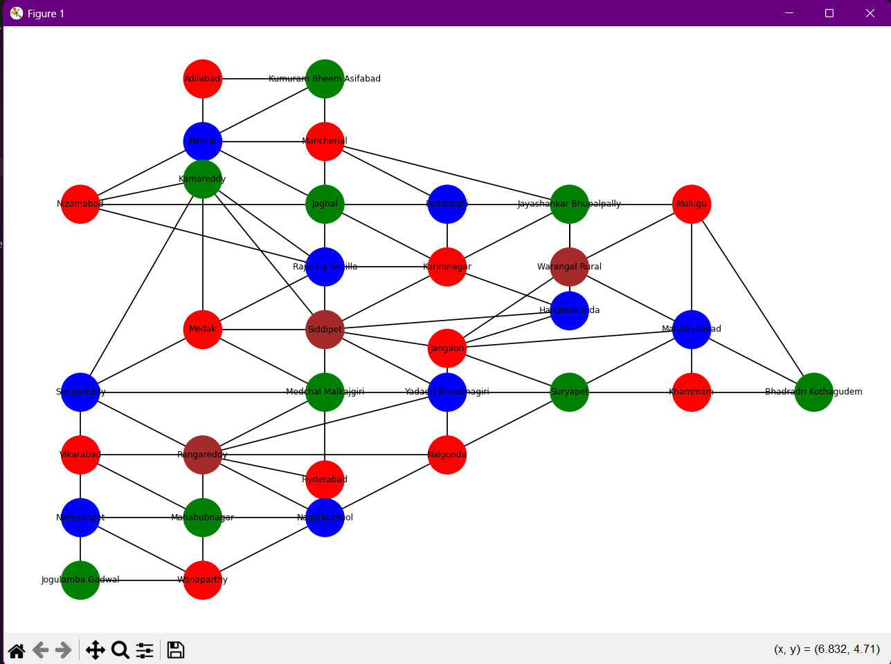

# Telangana Map Coloring


## Project Overview

This project implements the **Map Coloring Problem** for **Telangana districts** using the **Backtracking Algorithm** in Python.

The goal is to assign colors to each district such that **no two neighboring districts share the same color**.

The map is modeled as a **graph**, where:
- Nodes represent districts
- Edges represent neighboring relationships

The solution is visualized using **NetworkX and Matplotlib**.

This project demonstrates:

* Constraint Satisfaction Problem (CSP)
* Backtracking algorithm
* Graph representation using dictionaries
* Data visualization using NetworkX
* Recursive problem solving

---

## Requirements

* Python **3.8 or higher**

### Required Libraries
networkx
matplotlib


Install using:


pip install networkx matplotlib


---

## Project Structure

```
Q2/
│
├── Telangana.py
├── README.md
```
---

## Problem Representation

### Regions (Districts)

The project includes **33 districts of Telangana** such as:

```
Adilabad
Karimnagar
Hyderabad
Warangal
Nizamabad
Khammam
Mahabubnagar
...
```

---

### Colors Used

```
Red
Green
Blue
Brown
```

---

### Neighbor Relationships

Each district is connected to its neighboring districts using a graph structure.

Example:

```
Adilabad → Kumuram Bheem Asifabad, Nirmal
Karimnagar → Jagtial, Peddapalli, Siddipet
Hyderabad → Rangareddy, Medchal Malkajgiri
```

---

## How to Run the Program

1. Clone the repository


git clone https://github.com/Shashanth060/AI-CS2201--Assignments


2. Navigate to the project folder


cd "AI-CS2201--Assignments\Assignment4\Q2"


3. Run the Python script


python Telangana.py


---

## Example Output

```
Solution:
Adilabad -> Red
Kumuram Bheem Asifabad -> Green
Mancherial -> Red
Nirmal -> Blue
Nizamabad -> Red
Kamareddy -> Green
Jagtial -> Green
Peddapalli -> Blue
Rajanna Sircilla -> Blue
Karimnagar -> Red
Jayashankar Bhupalpally -> Green
Mulugu -> Red
Bhadradri Kothagudem -> Green
Khammam -> Red
Mahabubabad -> Blue
Warangal Rural -> Brown
Hanumakonda -> Blue
Jangaon -> Red
Siddipet -> Brown
Medak -> Red
Sangareddy -> Blue
Medchal Malkajgiri -> Green
Hyderabad -> Red
Vikarabad -> Red
Rangareddy -> Brown
Yadadri Bhuvanagiri -> Blue
Nalgonda -> Red
Suryapet -> Green
Mahabubnagar -> Green
Narayanpet -> Blue
Wanaparthy -> Red
Jogulamba Gadwal -> Green
Nagarkurnool -> Blue
```


A **graph visualization window** will open showing:
- Districts as nodes
- Borders as edges
- Colors assigned to each district

---

## Algorithm Used

### Backtracking Algorithm

Backtracking is used to solve the map coloring problem by trying different color combinations and reverting when constraints are violated.

Steps used in this implementation:

1. Start with an empty assignment.
2. Select an unassigned district.
3. Assign a color from available options.
4. Check if it conflicts with neighboring districts.
5. Recursively repeat for all districts.
6. Backtrack if no valid color is possible.

---

## Time Complexity
O(m^n)
Where:

* **n** = number of districts  
* **m** = number of colors  

---

## Visualization

The graph is visualized using:

- **NetworkX** for graph structure
- **Matplotlib** for rendering

Features:

- Custom layout for Telangana map
- Color-coded districts
- Clearly visible borders and labels

---

## Technologies Used

- Python
- Backtracking Algorithm
- Graph Theory
- NetworkX
- Matplotlib

---

## License

This project is open-source and free to use for educational purposes.